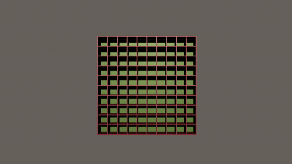

<h1 align="center"> UNITY - Maze Generator Tool </h1>

 ######################################################## 

## Section 1: The Project

 

A Unity Tool created to generate mazes based on a list of prefabs (floors and walls). The maze uses the backtracking algorithm to traverse a XY grid and randomly removes walls (with bitshift operations) to create a maze. 

## Section 2: Developer 

[Philipe Gouveia](https://github.com/philipe-go)

## Section 3: Asymptotic Analysis [Logical side]

#### O(1):

 - EWallType GetOpposite(EWallType wall)

 - List<Neighbour> GetUnvisitedCells(MazeCell cell, EWallType[,] maze, int column, int row)

#### O(N):

- EWallType[,] RunBackTracker(EWallType[,] maze, int column, int row)

#### O(N^2):

- EWallType[,] GenerateMaze(int column, int row)

- void DrawMaze(EWallType[,] maze)

## Section 4: Concept *[Wikipedia](https://en.wikipedia.org/wiki/Backtracking)*

"Backtracking is an important tool for solving constraint satisfaction problems,[2] such as crosswords, verbal arithmetic, Sudoku, and many other puzzles. It is often the most convenient (if not the most efficient[citation needed]) technique for parsing,[3] for the knapsack problem and other combinatorial optimization problems. It is also the basis of the so-called logic programming languages such as Icon, Planner and Prolog."